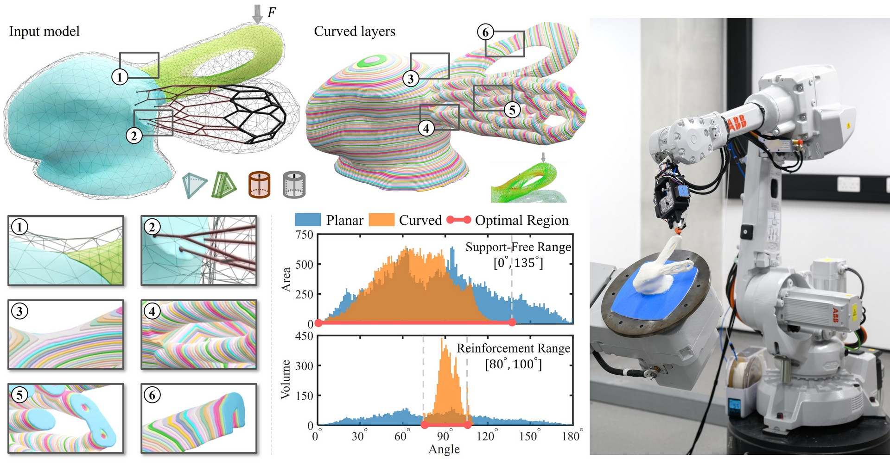
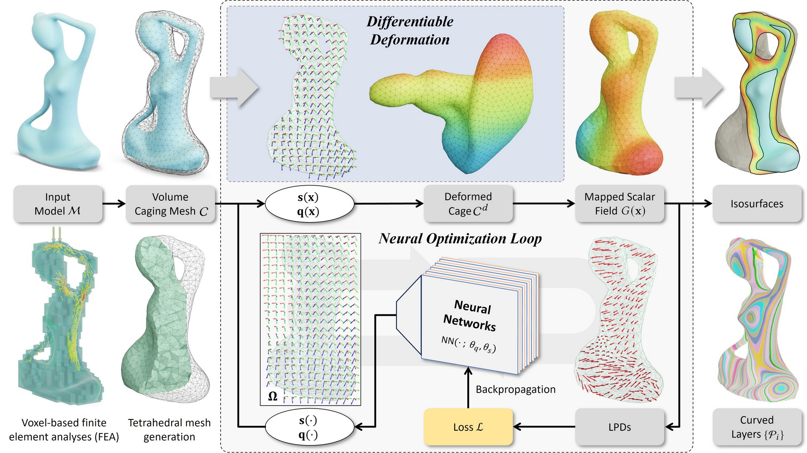
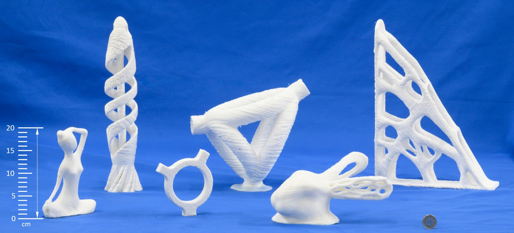

# [Neural Slicer for Multi-Axis 3D Printing](https://RyanTaoLiu.github.io/NeuralSlicer)



[Tao Liu](https://www.linkedin.com/in/tao-liu-730942225), [Tianyu Zhang](https://www.linkedin.com/in/tianyu-zhang-49b8231b5/), Yongxue Chen, Yuming Huang, and [Charlie C.L. Wang](https://mewangcl.github.io/), [*ACM Transactions on Graphics (SIGGRAPH 2024)*, vol.43, no.4(15 pages), July 2024](https://doi.org/10.1145/3658212)

[Arxiv Paper](http://arxiv.org/abs/2404.15061)

## Abstract
We introduce a novel neural network-based computational pipeline as a representation-agnostic slicer for multi-axis 3D printing. This advanced slicer can work on models with diverse representations and intricate topology. The approach involves employing neural networks to establish a deformation mapping, defining a scalar field in the space surrounding an input model. Isosurfaces are subsequently extracted from this field to generate curved layers for 3D printing. Creating a differentiable pipeline enables us to optimize the mapping through loss functions directly defined on the field gradients as the local printing directions. New loss functions have been introduced to meet the manufacturing objectives of support-free and strength reinforcement. Our new computation pipeline relies less on the initial values of the field and can generate slicing results with significantly improved performance. [Video Link](https://www.youtube.com/watch?v=qNm1ierKuUk)

## Installation

Please compile the S3_Slicer code with QMake in the following link before this setup.

### **Platform**: Ubuntu 20.02 + Python 3.8

We suggest using Anaconda as the virtual environment.

### Install Steps: 

### Setp 0: Compile the [S^3-Slicer](https://github.com/zhangty019/S3_DeformFDM) code with QMake for the printing field to slicers.

1. Add a pushbutton in the file '/S3_DeformFDM/ShapeLab/MainWindow.ui'
2. Create a correspondence slot function on_pushButtonXXX_Clicked() in '/S3_DeformFDM/ShapeLab/MainWindow.h' and '/S3_DeformFDM/ShapeLab/MainWindow.cpp', and copy the realization from file 'S3Slicer.cpp'.


### Step 1: Create and config the Python environment.

```
git clone https://github.com/RyanTaoLiu/NeuralSlicer
cd NeuralSlicer
conda create -n NNSlicer python=3.8
conda activate NNSlicer
conda install pytorch==1.11.0 torchvision==0.12.0 torchaudio==0.11.0 cudatoolkit=11.3 -c pytorch
pip install tqdm numpy scipy pymeshlab pyvista tetgen trimesh einops comet_ml 
```

(Optional)if you would like to use docker, just download from the docker-hub,
```
docker pull ryantaoliu/nnslicer
```
or directly build from local
```
docker build . -t nnslicer
```



## Usage

For the example of spiral fish,
### Step 0: Files Location
Download datafiles from [google drive](https://drive.google.com/drive/folders/19bvwt9CdLHqdVBGZUZ3-ex9OD24y7bOu?usp=sharing)
and replace to the data folder.


Optional use this code to download data(need to install gdown and tarfile)
```
python .\utils\data_download.py
```

**Input:**

Model file like tet-file lies in $PWD/data/TET_MODEL,

Cage file obj-file lies in $PWD/data/cage, 

FEA output file(using Voigt notation) is a txt file, it lies in $PWD/data/fem_result. 

**Output:**
The result lies in $PWD/data/results/{exp_name}/{date_time}, where includes,

*.obj shows the deformed boundary of models and cages, 

*.txt shows the new position of points in models or cages(can read by S3Slicer), 

*.ckpt is the check point file for neural network parameters.

Examples can be found in related folders.

### Step 1: Cage-based Field Generation
We first optimize the printing direction field via Neural Slicer, as

```
python main.py --exp_name spiral_fish --mesh spiral_fish.tet --cage None --stress None --wSF 1 --wSR 0 --wSQ 0 --wOP 0 --wRigid 100 --wConstraints 5 --wScaling 10 --wQuaternion 10 --nstep 5000 --wQuaternion 0.01 --lock_bottom --beta 2
```

Or by docker
```
docker run --gpus all -v $PWD:/usr/src/NNSlicer  -w /usr/src/NNSlicer --rm nnslicer python main.py --exp_name earrings_wc --mesh earring_wc_wb.tet --cage None.obj --stress None.txt --wSF 1 --wSR 0 --wSQ 0 --wOP 0 --wRigid 100 --wConstraints 5 --wScaling 10 --wQuaternion 10 --nstep 20000 --wQuaternion 0.01 --optimizer adam_directly --lock_bottom --beta 2
```

If using other models/options, help documents can be checked here.
```
python main.py --help
```

### Step 2: Cage-based layers Generation
Then achieve the cage-based layers by S^3-Slicer.
And remesh via meshlab, more details in the project [S^3-Slicer](https://github.com/zhangty019/S3_DeformFDM)

### Step 3: Model-based layers Generation(more details will be added further)
Run the following code to get the final layers by boolean.
```
python ./utils/slicer_cut_by_implicitFunction.py
```



## Reference
+ Tao Liu, Tianyu Zhang, Yongxue Chen, Yuming Huang, and Charlie C. L. Wang. 2024. Neural Slicer for Multi-Axis 3D Printing. ACM Transactions on Graphics, vol.43, no.4, Article 85 (15 pages), July 2024.

+ Tianyu Zhang, Yuming Huang, Piotr Kukulski, Neelotpal Dutta, Guoxin Fang, and Charlie C.L. Wang, "Support generation for robot-assisted 3D printing with curved layers", IEEE International Conference on Robotics and Automation (ICRA 2023), London, United Kingdom, May 29 - June 2, 2023.

+ Guoxin Fang, Tianyu Zhang, Sikai Zhong, Xiangjia Chen, Zichun Zhong, and Charlie C.L. Wang, "Reinforced FDM: Multi-axis filament alignment with controlled anisotropic strength", ACM Transactions on Graphics (SIGGRAPH Asia 2020), vol.39, no.6, article no.204 (15 pages), November 2020.

+ Tianyu Zhang, Guoxin Fang, Yuming Huang, Neelotpal Dutta, Sylvain Lefebvre, Zekai Murat Kilic, and Charlie C. L. Wang. 2022. S3-Slicer: A General Slicing Framework for Multi-Axis 3D Printing. ACM Transactions on Graphics (SIGGRAPH Asia 2022), vol.41, no.6, Article 204 (15 pages), December 2022.
## Contact Information
Tao Liu      (tao.liu@manchester.ac.uk)

Tianyu Zhang (tianyu.zhang-10@postgrad.manchester.ac.uk)